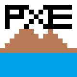

# Pixellate
A pixel art Creation Tool Built using HTML5 Canvas.  
It is a Progressive Web App (PWA) with offline compatibility.  
It is mobile-friendly and is very easy to use.  

## Overview
This App is available at https:pixellate.netlify.app

## Usage
You can choose Any Dimensions for your Canvas, *16 X 16* is the default dimension.  
Dimensions below *128 X 128* are preferable for smooth operation.
## Toolbar
### Pencil

The Pencil tool is the most basic tool and is used to draw pixels Freehand

### Eraser

The Eraser tool is used to erase a given pixel 1 pixel at a time. It has dimensions *1 X 1* and is fixed.

### Paint Tool

The Paint tool is used to Flood Fill a given color with a new color. It works smoothly for dimensions under 128 X 128.

### Line Tool

The line tool is used to draw a line segment between 2 points using the Bresenham line drawing algorithm.  

Click on the tool and click on 2 points to draw a line segment between them. 

### Circle Tool

The Circle Tool is used to draw a circle with a given center and Radius using Midpoint Circle Algorithm.

### Ellipse Tool

The Ellipse Tool is used to draw an ellipse with a given center and its radius along x-axis and y-axis.

## Utility Tools

### Undo/Redo

The Undo/Redo Functionality is not very advanced and is only capable of undoing/redoing 1 pixel at a time.  
It is only useful for correcting small mistakes, hence, it is advised to draw with care, or, add a frame if doing a big change with chances of mistake.

### Clear Window

This Tool is used to clear the current Canvas window.

Before:  
  
After:  
  

## Advanced Tools

### Import image

This Tool is Used to import an image and convert it to Pixel Art of Given Dimensions.

## Saving Pixel Art and GIF Animation

Once you are done with making your pixel art or animation frames you can export it as a PNG or GIF to share it on other platforms. 

### Saving Image

Save Image option is available in the drop-down on the top left corner, It will download a file named *canvas.png* with dimensions *10 x width X 10 x Height*

## Color Palette & Transparency

The Following colors are available on the Color Palette.

You can select any color by clicking on it.  

You can also set color Transparency to create translucent colors and create color combinations. This property can be used to create complex patterns with greater flexibility.

## PWA Support

This Web App is a Fully Compatible PWA and is installable.  

You can install it either from the Dropdown or using the "Add to Home Screen" Button From Options.  
